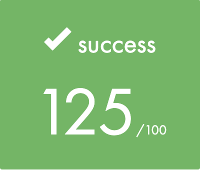
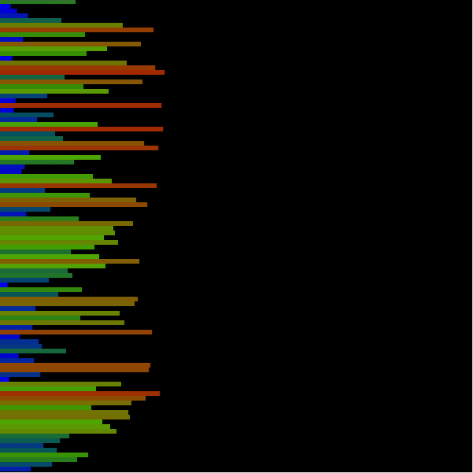

# push_swap

Push_swap is a School 42 project.
The goal of the project is to create a program that sorts stacks A and B using certain instructions.

[`push_swap.en.pdf`](/push_swap.en.pdf) is the task file.

## Usage

To compile the project, run:

```shell
$ make
```

To test the program (the result will appear in "results" folder):

```shell
$ ./average.sh
```

## Final score

125/100 (max)



## Overview

### Instructions

| instructions  | Description   |
|:-------------:|---------------|
| sa            | swap first two elements of stack A |
| sb            | swap first two elements of stack B |
| ss            | sa and sb at the same time |
| pa            | pops the first elememt on B and puts it on top of A |
| pb            | pops the first elememt on A and puts it on top of B |
| ra            | rotates stuck A up by one|
| rb            | rotates stuck B up by one |
| rr            | rotates both A and B up by one |
| rra           | rotates stuck A down by one |
| rrb           | rotates stuck B down by one |
| rrr           | rotates both A and B down by one |

### Visualisation


